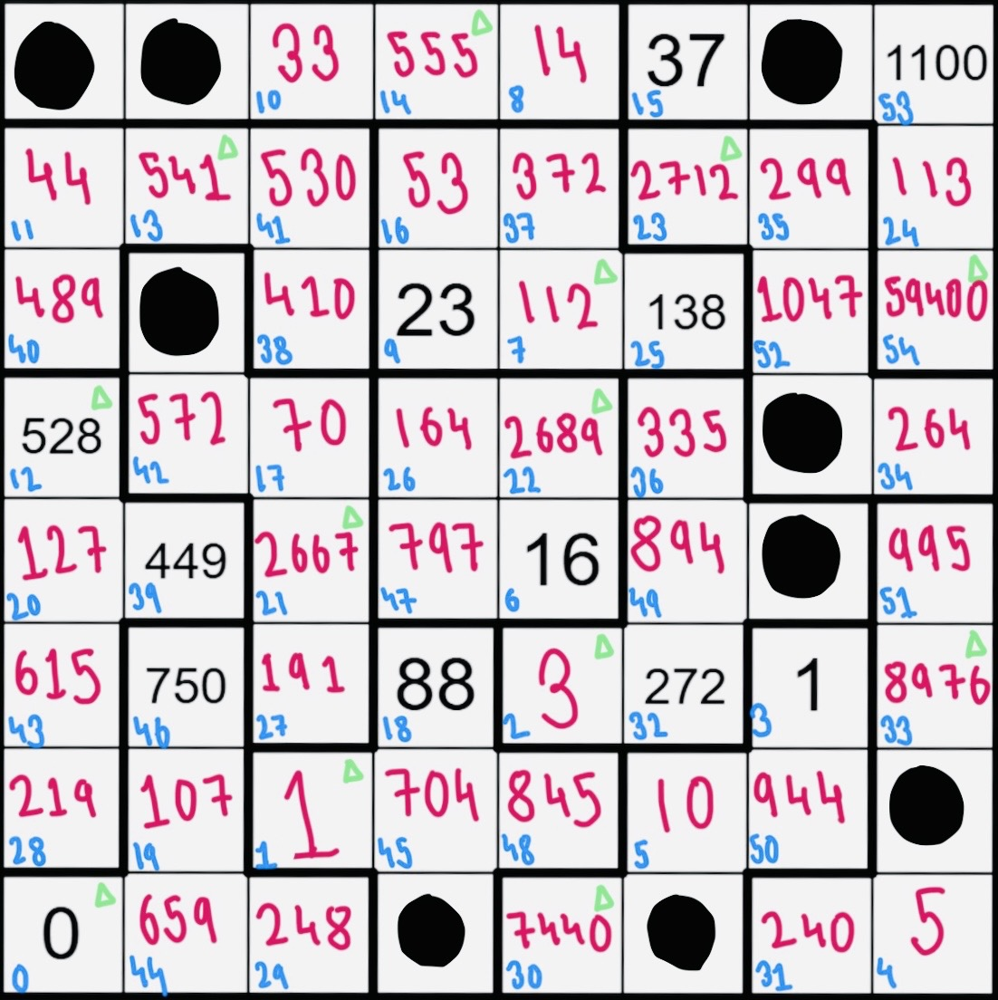

# Jane Street July 2026 Puzzle

This repo has my solution to Jane Street's July 2026 puzzle, "Pent-Up Frustration 3 / Knight Moves 7".

## What the puzzle is

You get an 8x8 grid split into 13 regions. Each region has one hidden "tower" square somewhere in it, and you don't know which one. A knight starts at the bottom left with a score of 0 and keeps moving until it has visited every tower. Each move changes the score depending on whether it stays flat, goes up onto a tower, or comes down off one. The knight wrote down its score every 3 moves at first, then every K moves after move 18, and K is also unknown. You get 11 of these written scores on the board and have to figure out the rest: the path, the towers, and K.

## What I did

I started on paper. I looked at the smallest score on the board, 1, and worked out by hand that there's only one way to reach it in exactly 3 moves. That told me exactly where move 3 landed, and it also told me the first two squares of the path had to be towers.

I did the same thing for the other clues on the board. That let me work out K (it's 7) and match every one of the 11 clues to its exact move number. Using the same kind of backward math, I also worked out which squares were towers and which weren't, by hand, for 37 out of the 64 squares.

After that there were still 7 regions with no known tower, so around 9000 ways they could be arranged. Too many to keep doing by hand, so I wrote code for the rest.

## Project Structure

* `Assets/`: Contains the final solved grid image.
* `Hand_Work.pdf`: Scanned pages of my manual deductions and backward math.
* `JS_07-Puzzle_Operator-Generator.py`: Checks what scores you can reach from a starting point over a few moves. I used this to check my hand calculations as I went, and also when hand calculations got impossible.
* `JS_07-Puzzle_Path-Algorithm.py`: The actual solver. It takes everything I already knew (which squares are towers, which regions are still unsure, the moves I'd already figured out) and searches for the path and the remaining towers at the same time, instead of trying every tower arrangement first and checking for a path after. Doing it together is a lot faster.

## How to run it

You need Python, nothing else.

1. Open `JS_07-Puzzle_Path-Algorithm.py`.
2. Near the top are some variables already filled in: `towers`, `non_towers`, `region_candidates`, `known_scores`, `known_ops`. These are the puzzle facts I worked out by hand.
3. Run it: `python JS_07-Puzzle_Path-Algorithm.py`
4. It prints the tower positions, the full path, and the score at every square.

If you want to use it on a different puzzle with the same rules, swap those variables at the top for what you know about your puzzle and run it again.

`JS_07-Puzzle_Operator-Generator.py` also works on its own if you just want to see what scores are reachable from some point. Change `score`, `height`, and `move_numbers` at the bottom and run it.

## Answer

33,609

### Solved Grid
